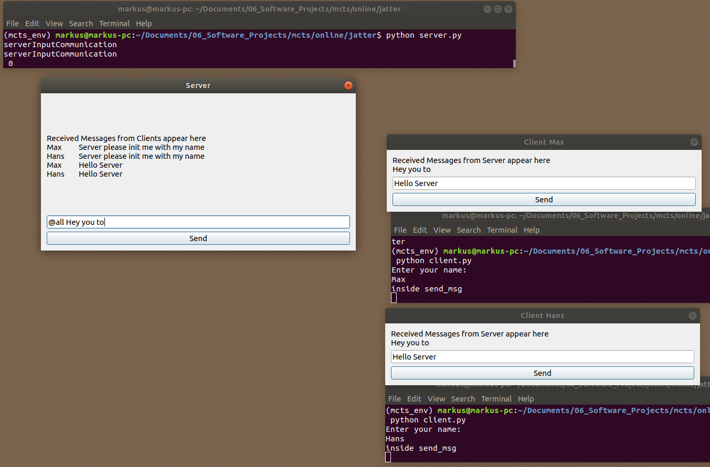
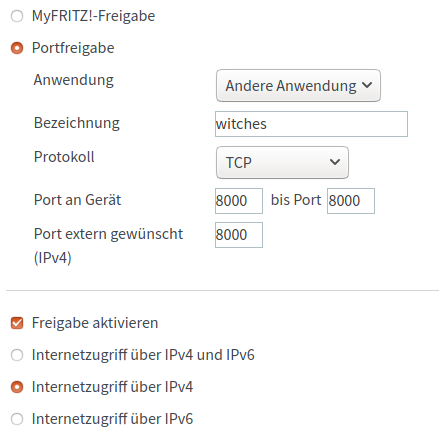

**jatter** is a simple PyQt5 bidirectional Chat Server Example. Using TcpSockets and Server one Server can connect using a GUI Interface (no while loop that is running forever....) to multiple clients.

**Bringup**
```
python server.py
python client.py # Enter name Max
python client.py # Enter name Hans
```



**Nice links**
* https://pymotw.com/2/socket/tcp.html


**Tests via Internet**
* Enable port forwarding (see image below for fritzbox)
* Go [here](http://checkip.dyndns.org/) *note your open IP address*
  * It should be something like: 87.163.**.***
  * it is not localhost which might be similar to 192.168.178.**
* Use one pc `python server.py`
* use other pc with mobile phone hotspot (not same wlan) `python client.py` enter *ip*
* start sending messages :)


**Enable Port**
Enable the port **8000** on your router.
see e.g. [fritzbox](https://praxistipps.chip.de/portfreigabe-in-der-fritzbox-so-gehts_12449)

